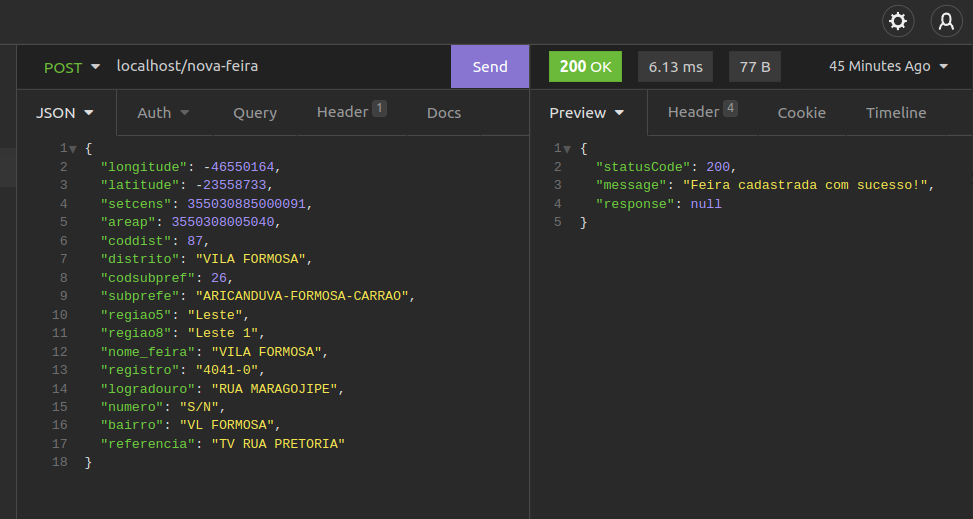
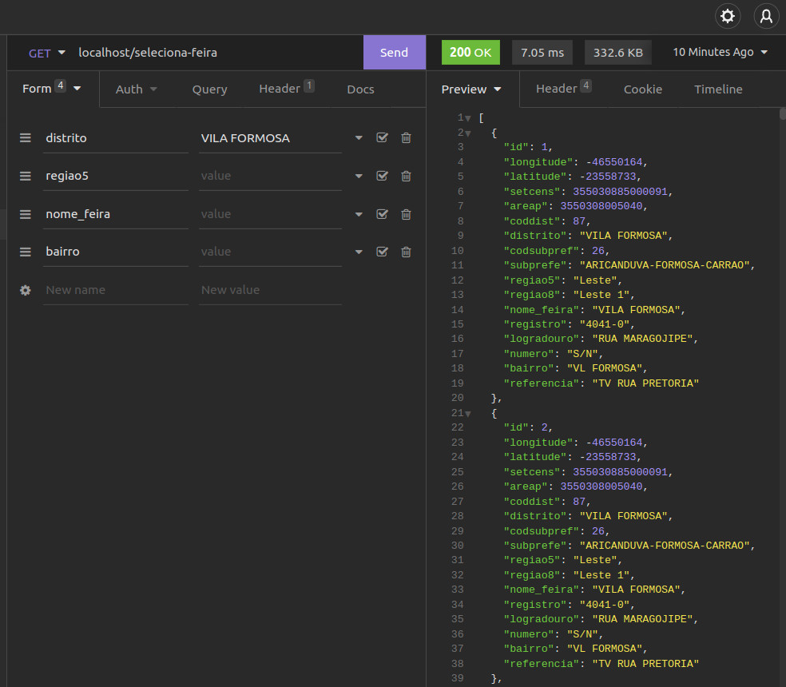
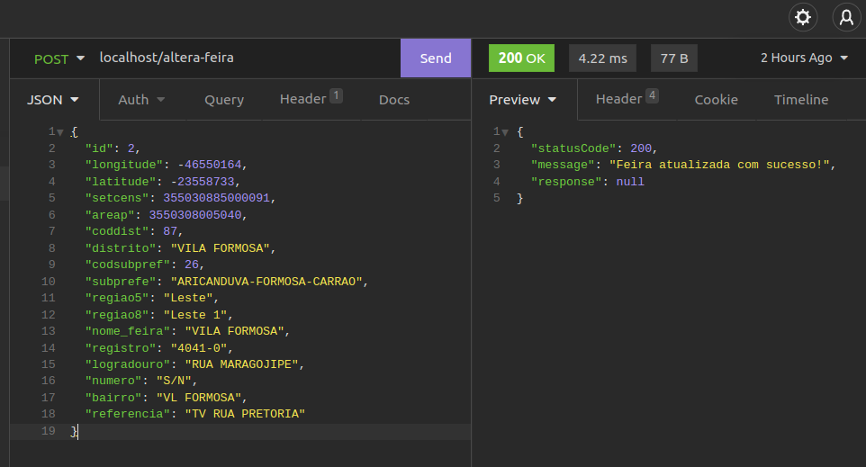
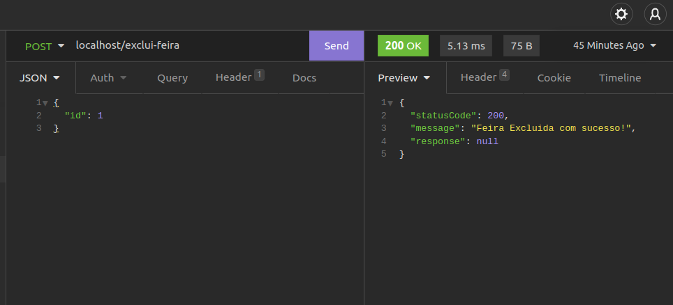

# FeirasLivres
API que expõe os dados disponíveis de Feiras Livres

As requisições demonstradas abaixo podem ser importadas para o aplicativo do Insomnia ou Algum outro compativel atraves do botão abaixo

[](https://insomnia.rest/run/?label=Feiras%20Livres&uri=https%3A%2F%2Fgithub.com%2Fdiiineeei%2FFeirasLivres%2Fblob%2Fmain%2FInsomnia_FeirasLivres.yaml)

#### Para Adicionar Uma Nova Feira Você deve fazer uma requisição enviando um Json como no modelo solicitado abaixo


Modelo de Json
```
{
    "longitude": -46550164,
    "latitude": -23558733,
    "setcens": 355030885000091,
    "areap": 3550308005040,
    "coddist": 87,
    "distrito": "VILA FORMOSA",
    "codsubpref": 26,
    "subprefe": "ARICANDUVA-FORMOSA-CARRAO",
    "regiao5": "Leste",
    "regiao8": "Leste 1",
    "nome_feira": "VILA FORMOSA",
    "registro": "4041-0",
    "logradouro": "RUA MARAGOJIPE",
    "numero": "S/N",
    "bairro": "VL FORMOSA",
    "referencia": "TV RUA PRETORIA"
}
```

Requisição Por CURL

```
curl --request POST \
    --url http://localhost/nova-feira \
    --header 'Content-Type: application/json' \
    --data '{
        "longitude": -46550164,
        "latitude": -23558733,
        "setcens": 355030885000091,
        "areap": 3550308005040,
        "coddist": 87,
        "distrito": "VILA FORMOSA",
        "codsubpref": 26,
        "subprefe": "ARICANDUVA-FORMOSA-CARRAO",
        "regiao5": "Leste",
        "regiao8": "Leste 1",
        "nome_feira": "VILA FORMOSA",
        "registro": "4041-0",
        "logradouro": "RUA MARAGOJIPE",
        "numero": "S/N",
        "bairro": "VL FORMOSA",
        "referencia": "TV RUA PRETORIA"
    }'
```

#### Para selecionar Feira você deve fazer uma requisição enviando os parametos como demonstrado abaixo


Exemplo de requisição

http://localhost/seleciona-feira?distrito=VILA%20FORMOSA

Requisição Por CURL

```
curl --request GET \
      --url http://localhost/seleciona-feira \
      --header 'Content-Type: application/x-www-form-urlencoded' \
      --data 'distrito=VILA FORMOSA' \
      --data regiao5= \
      --data nome_feira= \
      --data bairro=
```

#### Para atualizar informações de uma Feira você deve fazer uma requisição enviando um Json como no modelo solicitado abaixo


Modelo de Json
```
{
	"id": 2,
	"longitude": -46550164,
	"latitude": -23558733,
	"setcens": 355030885000091,
	"areap": 3550308005040,
	"coddist": 87,
	"distrito": "VILA FORMOSA",
	"codsubpref": 26,
	"subprefe": "ARICANDUVA-FORMOSA-CARRAO",
	"regiao5": "Leste",
	"regiao8": "Leste 1",
	"nome_feira": "VILA FORMOSA",
	"registro": "4041-0",
	"logradouro": "RUA MARAGOJIPE",
	"numero": "S/N",
	"bairro": "VL FORMOSA",
	"referencia": "TV RUA PRETORIA"
}
```

Requisição Por CURL

```
curl --request POST \
      --url http://localhost/altera-feira \
      --header 'Content-Type: application/json' \
      --data '{
            "id": 2,
            "longitude": -46550164,
            "latitude": -23558733,
            "setcens": 355030885000091,
            "areap": 3550308005040,
            "coddist": 87,
            "distrito": "VILA FORMOSA",
            "codsubpref": 26,
            "subprefe": "ARICANDUVA-FORMOSA-CARRAO",
            "regiao5": "Leste",
            "regiao8": "Leste 1",
            "nome_feira": "VILA FORMOSA",
            "registro": "4041-0",
            "logradouro": "RUA MARAGOJIPE",
            "numero": "S/N",
            "bairro": "VL FORMOSA",
            "referencia": "TV RUA PRETORIA"
    }'
```

#### Para Excluir as informações de uma Feira você deve fazer uma requisição enviando um Json como no modelo solicitado abaixo


Modelo de Json
```
{
	"id": 1
}
```

Requisição Por CURL

```
curl --request POST \
      --url http://localhost/exclui-feira \
      --header 'Content-Type: application/json' \
      --data '{
        "id": 1
        }'
```

#### Para importar informações das feiras publicas da prefeitura de SP você deve fazer uma requisição como no modelo solicitado abaixo


Modelo de Requisição
http://localhost/importar

Requisição Por CURL

```
curl --request GET --url http://localhost/importar
```


